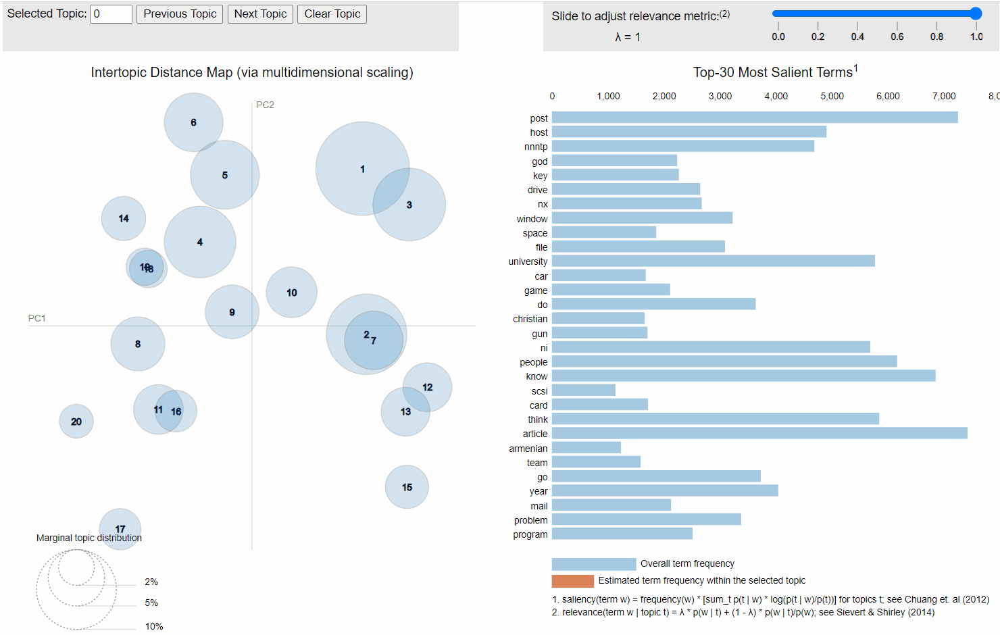

# Topic-Modeling-with-LDA

In this project I will use Latent Dirichlet Allocation (LDA) to extract hidden topics from a corpus.

## Introduction

LDA is a popular algorithm used for Topic Modeling. It builds a topic per document and a set of words per topic, modeled as Dirichlet distributions. Documents are modeled as multinomial distributions of topics and topics are modeled as multinomial distributions of words.

LDA is based on two assumptions:

- Documents are produced from a mixture of topics
- Topics are a mixture of words

These topics generate words based on their probability distribution.

LDA will also assume that the every chunk of text it is fed will contain words that are related at some level. We can therefore estimate which topics would have generated a given document and which words would have generated a given topic, since the goal is to obtain the most optimized document-topic distribution and topic-word distribution.

## Libraries Used

- Gensim
- SpaCy
- pyLDAvis

### Dataset

I used the [20 newsgroups](http://qwone.com/~jason/20Newsgroups/) dataset. In the script prepare_dataset.py I prepare the dataset for later use.

### Preprocessing

Using the functions _preprocess_ and _lemmatize_ from the script [utils.py](https://github.com/AnnaSenent/Topic-Modeling-with-LDA/blob/main/utils.py), I cleaned the text and created a new csv file in [preprocessing.py](https://github.com/AnnaSenent/Topic-Modeling-with-LDA/blob/main/preprocessing.py).

### Building the LDA models

I created the function lda_model in the script utils.py to build the LDA model and compute the perplexity and the coherence score. To do this, I used Bag-of-words vectors and tf-idf vectors and compared the results. The model with the tf-idf vectors achieved a better performance than the one with the Bag-of-words format.

### Visualizing the topics and top words per topic

In the script plots.py I created an interactive plot to display the topics and top words per topic using pyLDAvis.

Here you can see a caption of the interactive plot for the Bag-of-words model.

The way to interpret this is:

Each circle represents a topic. The larger the circle, the higher the number of documents about that topic.
Red bars represent the number of times a word was generated for a given topic, as estimated by the model.
Blue bars correspond to the frequency of a word in the entire corpus. The overall frequency of the most frequent words is displayed when no circle (topic) is selected.
Distance among the topics indicates the degree of relatedness.

For example, as shown in the gif, topics 7 and 2 have been estimated to be very similar. Their top words are "gun, right, law, people, state" and "people, year, president, state, mr" respectively. Therefore, these topics are likely to be about politics.

### Resources
